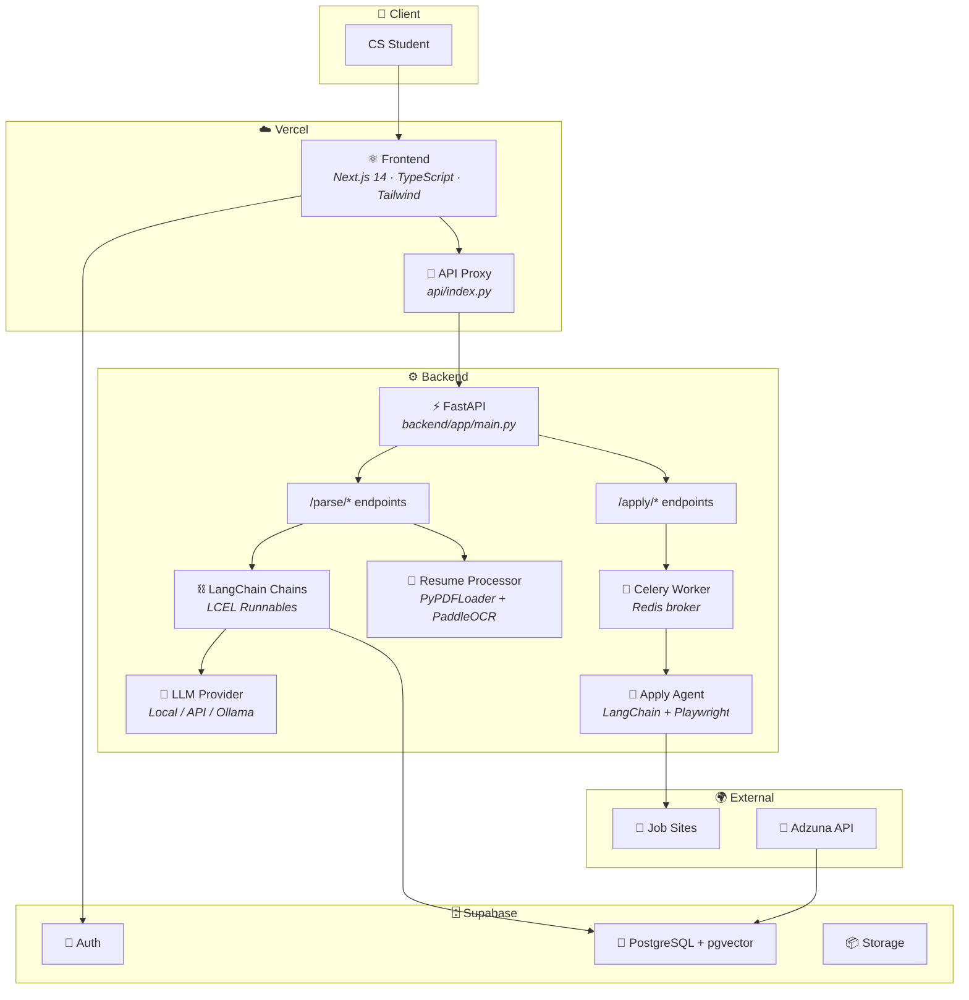
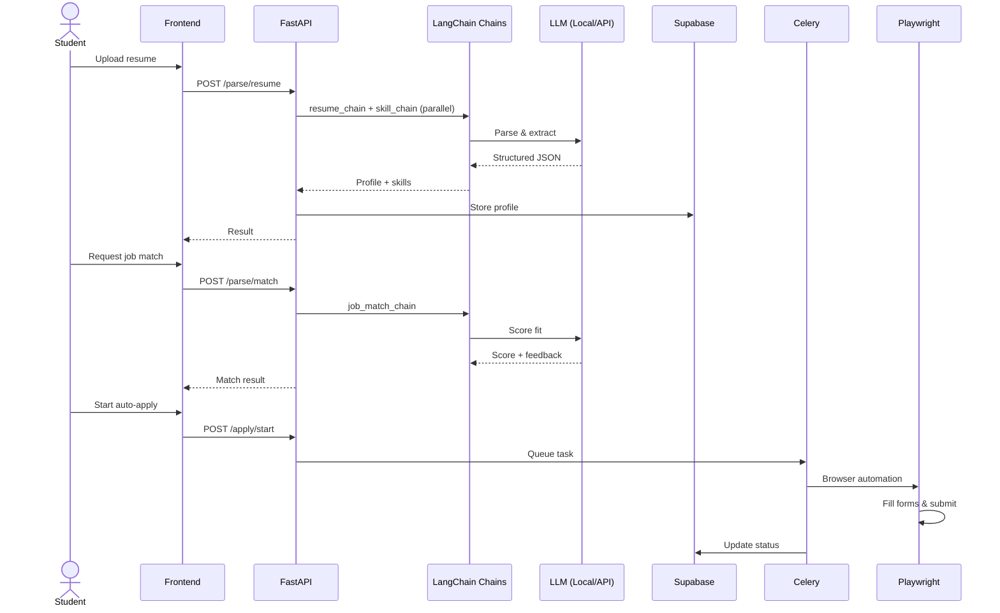

# Job-MCP

AI-powered job application automation for CS students — LangChain edition.

Users upload resumes, get AI-parsed profiles, receive job match scores, auto-generated cover letters, tailored resume rewrites, and automated browser-based applications. The entire LLM pipeline runs through LangChain LCEL chains with swappable providers (local Llama 3.2 3B, Claude, GPT-4o, Groq, Together, Ollama, or any OpenAI-compatible API).

---

## Table of Contents

1. [Architecture](#1-architecture)
2. [Project Structure](#2-project-structure)
3. [LangChain Pipeline](#3-langchain-pipeline)
4. [LLM Providers](#4-llm-providers)
5. [API Reference](#5-api-reference)
6. [Database Schema](#6-database-schema)
7. [Frontend](#7-frontend)
8. [Resume Processor](#8-resume-processor)
9. [Job Scraper](#9-job-scraper)
10. [Task Queue (Celery)](#10-task-queue-celery)
11. [Fine-Tuning Llama 3.2 3B](#11-fine-tuning-llama-32-3b)
12. [Environment Variables](#12-environment-variables)
13. [Setup & Local Development](#13-setup--local-development)
14. [Deployment](#14-deployment)
15. [Testing](#15-testing)
16. [Ethical Automation Policy](#16-ethical-automation-policy)
17. [Contributing](#17-contributing)
18. [License](#18-license)

---

## 1. Architecture



The frontend is a Next.js 14 app on Vercel. It talks to the FastAPI backend through a serverless proxy (`api/index.py`). The backend routes requests to LangChain LCEL chains, which call whichever LLM the user configures — a local model loaded into GPU, a cloud API, or a self-hosted vLLM server. Long-running tasks (auto-apply) are queued to Celery workers backed by Redis. Supabase provides auth, PostgreSQL (with pgvector), and file storage.

### Data Flow



---

## 2. Project Structure

```
Job-MCP/
├── api/
│   └── index.py                        # Vercel serverless proxy → FastAPI
├── backend/
│   ├── app/
│   │   ├── main.py                     # FastAPI entry point (v2.0)
│   │   ├── chains/                     # LangChain LCEL chains
│   │   │   ├── resume_chain.py         #   resume text → structured profile JSON
│   │   │   ├── skill_chain.py          #   text → categorized skills (keyword + LLM)
│   │   │   ├── job_match_chain.py      #   (profile, JD) → match score + feedback
│   │   │   ├── cover_letter_chain.py   #   (profile, JD) → tailored cover letter
│   │   │   ├── resume_writer_chain.py  #   (profile, JD) → improved resume
│   │   │   └── apply_agent.py          #   LangChain agent + Playwright tools
│   │   ├── routers/
│   │   │   ├── parse.py                #   /parse/* endpoints
│   │   │   └── apply.py                #   /apply/* endpoints
│   │   ├── services/
│   │   │   ├── llm_provider.py         #   LLM factory (7 providers)
│   │   │   ├── model_loader.py         #   Per-task fine-tuned model loading
│   │   │   ├── resume_processor.py     #   PDF/OCR text extraction + LangChain pipeline
│   │   │   └── browser.py             #   Playwright singleton
│   │   └── models/
│   ├── tasks/
│   │   └── celery_app.py              #   Celery worker + background tasks
│   ├── tests/
│   │   └── test_resume_processor.py
│   ├── .env.example
│   └── Dockerfile
├── frontend/                           # Next.js 14 (TypeScript + Tailwind)
│   ├── app/                            #   Landing, login, signup, dashboard, etc.
│   ├── components/                     #   Navbar, AnimatedJobTitle, etc.
│   └── lib/supabase.ts
├── scripts/
│   └── fetch_jobs.py                  #   Adzuna API → CSV job scraper
├── finetune/                           # Fine-tuning Llama 3.2 3B
│   ├── configs/                        #   LoRA YAML configs per task
│   │   ├── lora_extraction.yaml
│   │   ├── lora_cover_letter.yaml
│   │   ├── lora_resume_writer.yaml
│   │   └── full_finetune.yaml
│   ├── scripts/
│   │   ├── download_datasets.py        #   Download HuggingFace datasets
│   │   ├── format_dataset.py           #   Convert to chat/alpaca/sharegpt format
│   │   ├── train_lora.py               #   LoRA fine-tune (Unsloth + PEFT)
│   │   ├── train_full.py               #   Full parameter fine-tune
│   │   ├── evaluate.py                 #   Evaluation harness
│   │   ├── merge_and_export.py         #   Merge LoRA → standalone / GGUF
│   │   └── serve_model.py              #   Launch vLLM / TGI
│   ├── data/                           #   Downloaded datasets (.gitkeep)
│   └── requirements-finetune.txt
├── docs/
│   └── db-schema.sql
├── requirements.txt
├── vercel.json
└── LICENSE
```

---

## 3. LangChain Pipeline

Every LLM operation is an LCEL (LangChain Expression Language) Runnable. Chains are composable, traceable (LangSmith-compatible), and support `.ainvoke()`, `.abatch()`, and callbacks.

| Chain | Input | Output | File |
|-------|-------|--------|------|
| `resume_chain` | `{resume_text}` | Structured profile JSON (name, education, experience, skills, etc.) | `chains/resume_chain.py` |
| `skill_chain` | `{text}` | `{skills: [...], categorized: {...}}` — merged keyword + LLM extraction | `chains/skill_chain.py` |
| `job_match_chain` | `{profile, job_description}` | `{score, fit_level, matching_skills, missing_skills, recommendation}` | `chains/job_match_chain.py` |
| `cover_letter_chain` | `{profile, job_description, company_name, tone}` | `{cover_letter, word_count, key_points}` | `chains/cover_letter_chain.py` |
| `resume_writer_chain` | `{profile, job_description}` | `{improved_resume, changes_made, skills_highlighted, word_count}` | `chains/resume_writer_chain.py` |
| `apply_agent` | `{profile, job_url, credentials, preferences}` | Agent outcome (success / failure / needs-human-review) | `chains/apply_agent.py` |

The resume processor (`resume_processor.py`) composes `resume_chain` and `skill_chain` in parallel using `RunnableParallel`, then merges results. The `apply_agent` is a LangChain `AgentExecutor` with Playwright browser tools (navigate, fill form, click, upload file, screenshot, etc.).

Every chain builder accepts an optional `llm` parameter. If `None`, it uses the default LLM from `LLM_PROVIDER` env var.

---

## 4. LLM Providers

The `llm_provider.py` factory supports 7 providers. Set the default via env vars, or override per-request with the `provider` field.

| Provider | Env Value | Description |
|----------|-----------|-------------|
| `custom` | `LLM_PROVIDER=custom` | OpenAI-compatible endpoint (vLLM, TGI, etc.) |
| `anthropic` | `LLM_PROVIDER=anthropic` | Claude API |
| `openai` | `LLM_PROVIDER=openai` | OpenAI API |
| `azure_openai` | `LLM_PROVIDER=azure_openai` | Azure OpenAI |
| `huggingface` | `LLM_PROVIDER=huggingface` | HuggingFace Inference API / Endpoints |
| `ollama` | `LLM_PROVIDER=ollama` | Local Ollama server |
| `openai_compatible` | `LLM_PROVIDER=openai_compatible` | Any OpenAI-compatible API (Groq, Together, Fireworks) |

Every API endpoint accepts a `provider` query param or form field to override the default per-request.

### Per-Task Fine-Tuned Models

Each pipeline task can route to its own model via env vars. If set, these override the global `LLM_PROVIDER` for that task:

```bash
EXTRACTION_MODEL_BASE_URL=http://localhost:8080/v1
EXTRACTION_MODEL_NAME=extraction-merged

COVER_LETTER_MODEL_BASE_URL=http://localhost:8081/v1
COVER_LETTER_MODEL_NAME=cover-letter-merged

RESUME_WRITER_MODEL_BASE_URL=http://localhost:8080/v1
RESUME_WRITER_MODEL_NAME=resume-writer-merged
```

If no task-specific vars are set, everything falls back to `LLM_PROVIDER`.

---

## 5. API Reference

Base URL: `http://localhost:8000` (dev) or `/api` (Vercel).

### `GET /`
Health check. Returns `{"message": "Welcome to Job-MCP API v2"}`.

### `GET /providers`
Lists all supported LLM providers and the current default.

### `POST /parse/resume`
Upload a resume (PDF or image) → structured profile + skills.

Form fields: `file` (required), `provider` (optional).

### `POST /parse/skills`
Extract and categorize skills from text.

Body: `{"text": "...", "provider": "..."}` → `{"skills": [...], "categorized": {...}}`

### `POST /parse/match`
Score candidate-job fit.

Body: `{"profile": {...}, "job_description": "...", "provider": "..."}` → `{"score": 85, "fit_level": "strong", ...}`

### `POST /parse/cover-letter`
Generate a tailored cover letter.

Body: `{"profile": {...}, "job_description": "...", "company_name": "Acme", "tone": "professional", "provider": "..."}`

### `POST /parse/improve-resume`
Rewrite a resume tailored for a specific job.

Body: `{"profile": {...}, "job_description": "...", "provider": "..."}`

### `POST /apply/start`
Queue auto-apply tasks for job URLs.

Body: `{"user_id": "...", "job_urls": ["..."], "credentials": {...}, "preferences": {...}, "provider": "..."}`

### `GET /apply/status/{task_id}`
Check status of an auto-apply task.

### `POST /apply/stop/{task_id}`
Cancel a running task.

---

## 6. Database Schema

Four PostgreSQL tables on Supabase with pgvector and RLS:

```sql
CREATE TABLE users (
  id UUID PRIMARY KEY,
  email TEXT NOT NULL
);

CREATE TABLE profiles (
  id UUID PRIMARY KEY,
  user_id UUID REFERENCES users(id),
  skills JSONB,
  experience JSONB
);

CREATE TABLE applications (
  id UUID PRIMARY KEY,
  user_id UUID REFERENCES users(id),
  job_url TEXT,
  status TEXT,
  applied_at TIMESTAMP
);

CREATE TABLE preferences (
  id UUID PRIMARY KEY,
  user_id UUID REFERENCES users(id),
  job_types TEXT[]
);

CREATE EXTENSION IF NOT EXISTS vector;
ALTER TABLE profiles ENABLE ROW LEVEL SECURITY;
```

Full SQL at `docs/db-schema.sql`.

---

## 7. Frontend

Next.js 14 App Router with TypeScript and Tailwind CSS. Dark-mode glassmorphism design.

**Pages:** Landing (hero + bento grid), Login (email + Google OAuth), Sign Up, Dashboard (auth-gated stats), Profile (editor stub), Features (showcase grid), Resources (about, privacy, support).

**Components:** `Navbar` (auth-aware, scroll-responsive), `AnimatedJobTitle` (rotating hero text), `LiquidGlassButton` (glassmorphism CTA), `UploadForm` (resume upload).

**Auth:** Supabase Auth handles email/password and Google OAuth. JWT session tokens managed automatically.

---

## 8. Resume Processor

`backend/app/services/resume_processor.py` handles the full resume ingestion pipeline:

1. **Text Extraction** — PyPDF2 for PDFs, PaddleOCR for images (PNG, JPG, BMP, TIFF).
2. **Text Cleaning** — Normalizes whitespace, removes special characters, collapses repeated punctuation.
3. **LLM Parsing** — `resume_chain` extracts structured profile JSON (name, education, experience, skills, certifications, projects, languages).
4. **Skill Extraction** — `skill_chain` runs keyword matching (~80 tech skills) in parallel with LLM extraction, then merges and deduplicates.
5. **Contact Info** — Regex extraction of email and phone (no LLM needed).

Steps 3 and 4 run concurrently via `asyncio.gather`. CLI: `python -m backend.app.services.resume_processor resume.pdf`

---

## 9. Job Scraper

`scripts/fetch_jobs.py` fetches job listings from the Adzuna API and exports to CSV. Standalone utility for development data.

```bash
# Set in .env.local: ADZUNA_APP_ID, ADZUNA_APP_KEY
python scripts/fetch_jobs.py
```

---

## 10. Task Queue (Celery)

Background tasks run on Celery with Redis. Configured in `backend/tasks/celery_app.py`.

The `apply_to_job` task builds a LangChain agent with Playwright browser tools, navigates to a job URL, fills forms, and submits applications.

```bash
celery -A backend.tasks.celery_app worker --loglevel=info
```

---

## 11. Fine-Tuning Llama 3.2 3B

Fine-tune `meta-llama/Llama-3.2-3B-Instruct` for the pipeline's three core tasks using public HuggingFace datasets. All training data comes from real datasets — no synthetic or generated data.

### Datasets

| Task | Dataset | Rows | Description |
|------|---------|------|-------------|
| Extraction | `datasetmaster/resumes` | ~1,000 | Structured resume profiles in nested JSON with experience, education, skills, projects |
| Extraction | `InferencePrince555/Resume-Dataset` | ~2,400 | Resume text + category labels |
| Cover Letter | `ShashiVish/cover-letter-dataset` | 1,162 | Job + cover letter pairs |
| Cover Letter | `dhruvvaidh/cover-letter-dataset-llama3` | 1,162 | Same data formatted for Llama 3 |
| Resume Writer | `MikePfunk28/resume-training-dataset` | 22,855 | Chat-format resume coaching conversations (critique, improve, rewrite) |

Total: ~27,000+ real examples across all tasks.

### Quick Start

```bash
pip install -r finetune/requirements-finetune.txt

# 1. Download all datasets from HuggingFace
python finetune/scripts/download_datasets.py --task all

# 2. Fine-tune with LoRA (pick a task)
python finetune/scripts/train_lora.py --config finetune/configs/lora_extraction.yaml
python finetune/scripts/train_lora.py --config finetune/configs/lora_cover_letter.yaml
python finetune/scripts/train_lora.py --config finetune/configs/lora_resume_writer.yaml

# 3. Evaluate
python finetune/scripts/evaluate.py \
    --model-path outputs/extraction-lora \
    --test-data finetune/data/extraction_val.jsonl \
    --task extraction

# 4. Merge LoRA → standalone model
python finetune/scripts/merge_and_export.py \
    --adapter-path outputs/extraction-lora \
    --output-path outputs/extraction-merged

# 5. Serve with vLLM
python finetune/scripts/serve_model.py \
    --model-path outputs/extraction-merged --port 8080

# 6. Point Job-MCP at it
export LLM_PROVIDER=custom
export CUSTOM_LLM_BASE_URL=http://localhost:8080/v1
export LLM_MODEL=extraction-merged
```

### Why Llama 3.2 3B?

Fits in ~6GB VRAM with QLoRA. Distilled from Llama 3.1 8B/70B so it punches above its weight on instruction-following. ~50 tokens/sec on RTX 3090 with vLLM. Free Colab training via Unsloth.

### Multi-Task vs Per-Task

Train one model for all tasks using `full_finetune.yaml` (the model distinguishes tasks by system prompt), or train separate LoRA adapters per task and serve them on a single base model:

```bash
python -m vllm.entrypoints.openai.api_server \
    --model meta-llama/Llama-3.2-3B-Instruct \
    --enable-lora \
    --lora-modules extraction=outputs/extraction-lora \
                    cover_letter=outputs/cover-letter-lora \
                    resume_writer=outputs/resume-writer-lora
```

### Data Pipeline

```
HuggingFace Datasets
        │
        ▼
  download_datasets.py
        │
        ▼
  finetune/data/*.jsonl
        │
        ▼
  train_lora.py / train_full.py
        │
        ▼
  outputs/*-lora/
        │
        ▼
  merge_and_export.py → outputs/*-merged/
        │
        ▼
  serve_model.py (vLLM) → Job-MCP API
```

### Finetune Scripts

| Script | Purpose |
|--------|---------|
| `download_datasets.py` | Download and convert HuggingFace datasets to chat-format JSONL |
| `format_dataset.py` | Convert between chat/alpaca/sharegpt formats |
| `train_lora.py` | LoRA fine-tune with Unsloth + PEFT |
| `train_full.py` | Full parameter fine-tune |
| `evaluate.py` | Evaluate fine-tuned model against test set |
| `merge_and_export.py` | Merge LoRA adapter into standalone model or GGUF |
| `serve_model.py` | Launch vLLM / TGI / Ollama for inference |

---

## 12. Environment Variables

### Frontend (`frontend/.env.local`)

| Variable | Description |
|----------|-------------|
| `NEXT_PUBLIC_SUPABASE_URL` | Supabase project URL |
| `NEXT_PUBLIC_SUPABASE_ANON_KEY` | Supabase anonymous key |

### Backend (`backend/.env`)

| Variable | Default | Description |
|----------|---------|-------------|
| `LLM_PROVIDER` | `custom` | Default LLM provider |
| `LLM_MODEL` | provider-specific | Model name or path |
| `LLM_TEMPERATURE` | `0` | Generation temperature |
| `LLM_MAX_TOKENS` | `4096` | Max output tokens |
| `CUSTOM_LLM_BASE_URL` | — | OpenAI-compatible endpoint URL |
| `CUSTOM_LLM_API_KEY` | `not-needed` | API key for custom endpoint |
| `ANTHROPIC_API_KEY` | — | Anthropic Claude API key |
| `OPENAI_API_KEY` | — | OpenAI API key |
| `AZURE_OPENAI_ENDPOINT` | — | Azure OpenAI endpoint |
| `AZURE_OPENAI_API_KEY` | — | Azure OpenAI key |
| `AZURE_OPENAI_DEPLOYMENT` | — | Azure deployment name |
| `HUGGINGFACE_API_TOKEN` | — | HuggingFace token |
| `HUGGINGFACE_ENDPOINT_URL` | — | HF Inference Endpoint URL |
| `OLLAMA_BASE_URL` | `http://localhost:11434` | Ollama server URL |
| `SUPABASE_URL` | — | Supabase project URL |
| `SUPABASE_KEY` | — | Supabase service role key |
| `REDIS_URL` | `redis://localhost:6379/0` | Redis connection string |
| `ADZUNA_APP_ID` | — | Adzuna API app ID |
| `ADZUNA_APP_KEY` | — | Adzuna API key |

Per-task model overrides: `EXTRACTION_MODEL_BASE_URL`, `EXTRACTION_MODEL_NAME`, `EXTRACTION_MODEL_PATH`, `EXTRACTION_ADAPTER_PATH` (same pattern for `COVER_LETTER_*`, `RESUME_WRITER_*`).

Template at `backend/.env.example`.

---

## 13. Setup & Local Development

### Prerequisites

Node.js >= 18, Python >= 3.10, Redis, Git. Accounts: Supabase, plus at least one LLM provider API key.

### Step-by-Step

```bash
# 1. Clone
git clone https://github.com/innovateorange/Job-MCP.git
cd Job-MCP

# 2. Frontend
cd frontend
npm install
# Create frontend/.env.local with Supabase credentials
npm run dev                                  # → http://localhost:3000

# 3. Backend (new terminal)
cd ..
python -m venv venv
source venv/bin/activate
pip install -r requirements.txt
playwright install
# Create backend/.env from backend/.env.example
uvicorn backend.app.main:app --reload        # → http://localhost:8000

# 4. Celery worker (new terminal)
source venv/bin/activate
celery -A backend.tasks.celery_app worker --loglevel=info

# 5. Redis
redis-server
```

### Supabase Setup

1. Create a project at supabase.com.
2. Run `docs/db-schema.sql` in the SQL Editor.
3. Enable pgvector extension.
4. Configure RLS policies.
5. **Optional — Google sign-in** (used by the app’s “Sign in with Google” buttons):
   - In Supabase: **Authentication** → **Providers** → **Google** — enable, add your Google **Client ID** and **Client Secret** from Google Cloud Console.
   - In Google Cloud, OAuth “Authorized redirect URIs” must include: `https://<project-ref>.supabase.co/auth/v1/callback` (Supabase shows the exact value in the provider form).
   - In Supabase: **Authentication** → **URL Configuration** — set **Site URL** to your deployed site (e.g. `https://<your-app>.vercel.app`). Under **Redirect URLs**, add that same site plus `http://localhost:3000` for local dev, and the app’s callback path: `https://<your-app>.vercel.app/auth/callback` and `http://localhost:3000/auth/callback`.
6. For **Vercel** builds, set **Environment Variables** in the Vercel project: `NEXT_PUBLIC_SUPABASE_URL` and `NEXT_PUBLIC_SUPABASE_ANON_KEY` (for **Production** and **Preview** so previews work). The Next.js app bakes `NEXT_PUBLIC_*` at build time.

---

## 14. Deployment

### Frontend + API Proxy (Vercel)

`vercel.json` builds the Next.js app and mounts FastAPI under `/api`. Connect your GitHub repo to Vercel, set env vars, and deploy.

### Backend Workers (Render / Railway)

Use `backend/Dockerfile`. Installs system deps for PaddleOCR, Python packages, and Chromium. For Celery, override CMD to `celery -A backend.tasks.celery_app worker --loglevel=info`.

---

## 15. Testing

```bash
pytest backend/tests/ -v
```

Tests cover text cleaning, contact extraction, all chain builders (with mock LLMs), and the LLM provider factory.

---

## 16. Ethical Automation Policy

**Consent** — No action without explicit user initiation.
**Rate Limiting** — Configurable limits on Celery workers and API scrapers.
**TOS Compliance** — Standard browser automation; no CAPTCHA bypassing.
**Transparency** — Every application logged with timestamp and status.
**Data Privacy** — Supabase RLS ensures per-user data isolation.

---

## 17. Contributing

Fork, branch (`git checkout -b feature/your-feature`), commit with conventional commits (`feat:`, `fix:`, `docs:`), push, and open a PR.

---

## 18. License

MIT License. See [LICENSE](LICENSE).
